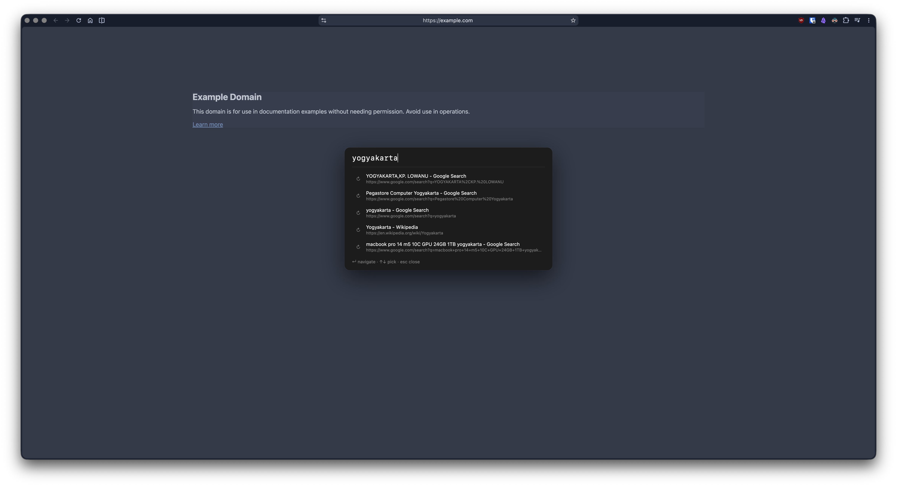

# URL Spotlight

Chrome/Helium extension. One macOS-style Spotlight overlay for URL navigation, search-engine queries, open tabs, bookmarks, and history — all fuzzy-searchable and keyboard-driven.

## Install

1. Open `chrome://extensions/` (or `helium://extensions/`)
2. Enable **Developer mode**
3. Click **Load unpacked** → select `url-spotlight/`
4. Set shortcut at `chrome://extensions/shortcuts` (default `Cmd+T`/`Ctrl+T` usually blocked by browser — pick e.g. `Cmd+Shift+P`)

## Use

- Press shortcut on any page (or `Cmd+Shift+O` / `Ctrl+Shift+O`, same overlay) → appears centered, listing open tabs first
- **Hyper key** (opt-in) binds `⌃⌥⇧⌘`+`Y` to the same overlay — see [Hyper key](#hyper-key) below
- Type URL, domain, or search query — open tabs, bookmarks, and history are fuzzy-matched live
- `↑` / `↓` pick a result
- **`1`-`9`** jump straight to the numbered result (badges shown on each row) — no need to arrow down first
- **`Shift`+digit** types the literal number into the query instead of jumping (e.g. `web3`, `404`) — hold Shift while typing any digit
- `Alt`+digit (`⌥`+digit) also jumps to a numbered result, as a secondary binding
- `Enter` open/switch to selection; `Shift+Enter` open in the current tab instead of a new one
- Click a row to open/switch, `Shift+Click` to open in the current tab
- `Esc` or click outside to close



## Restricted pages & new tab

- On pages content scripts can't reach (`chrome://`, Web Store, etc.) the shortcut opens the same overlay in a small popup window instead — same keys, same behavior
- The sidebar handles those pages differently: it falls back to Chrome's native side panel — see [Sidebar](#sidebar)
- The new-tab page shows the overlay directly, over the widgets below

## Hyper key

Opens the overlay with `⌃⌥⇧⌘`+`Y`, so a Caps Lock remapped to Hyper becomes a
one-key launcher. There are two ways to set this up, and you want **one or the
other, not both**.

macOS has no built-in Caps Lock → Hyper mapping (System Settings only offers a
single modifier), and an extension can't create one — that's OS-privileged. So
either route needs Raycast or Karabiner to supply the Hyper key itself.

### Option A — Karabiner rule (works everywhere, including `chrome://`)

`karabiner/url-spotlight-hyper.json` rewrites `⌃⌥⇧⌘`+`Y` into `⌘⇧O`, the
extension's normal browser shortcut. Chrome then fires it on *every* page, and
restricted pages fall back to the popup window described above.

Requires [Karabiner-Elements](https://karabiner-elements.pqrs.org). Install by
copying the file into `~/.config/karabiner/assets/complex_modifications/`, then
enabling the rule under Karabiner → Complex Modifications → Add rule. Or import
it directly:

```
karabiner://karabiner/assets/complex_modifications/import?url=https://raw.githubusercontent.com/Shidiq/chrome-spotlight/main/karabiner/url-spotlight-hyper.json
```

Leave the extension's own **Hyper Key** toggle **off** in this mode — Karabiner
consumes the keystroke, so the in-extension matcher never sees it.

Three things to adjust if your setup differs:

- The rule sends `⌘⇧O`. If you rebound the shortcut at
  `chrome://extensions/shortcuts`, change the rule's `to` block to match.
- It's scoped to Chrome and Helium via `frontmost_application_if`, so `⌃⌥⇧⌘`+`Y`
  keeps working for other apps. Delete the `conditions` block to make it global,
  or add your browser's bundle ID (find it in Karabiner-EventViewer →
  Frontmost Application).
- If you map Caps Lock → Hyper *in Karabiner* rather than Raycast, that rule
  must sit **above** this one — Karabiner applies rules in list order.

### Option B — extension toggle (no extra software beyond a Hyper key)

Turn on **Hyper Key** in the options page and pick the key. `content.js` matches
the combo directly.

Simpler, but it only covers pages content scripts can run on: `http(s)://`,
`file://` (needs "Allow access to file URLs" at `chrome://extensions`), and the
new tab page. It does **not** fire on `chrome://` pages, the Web Store, or the
built-in PDF viewer — content scripts are barred there by the browser, and
`chrome.commands` rejects a four-modifier shortcut (it requires Ctrl or Alt and
forbids the two together). On those pages, use `⌘⇧O`, or Option A.

## New tab widgets

Three columns over an animated aurora background, capped at 1440px and centered so rows don't stretch on a wide display. Each card sizes to its content and scrolls internally once it outgrows the column. Every widget can be switched off individually in the extension's options page.

- **Clock and Up next** — time and date top-left; the next upcoming calendar event with a live countdown top-right
- **Agenda** — one grouped list from Google Calendar covering today through the next 8 days, with `Today` always shown as the anchor even when it's empty. Connect one or more Google accounts and pick which calendars appear, per account, in the options page
- **Tasks** — open items from a Notion database, sorted by priority then due date, with overdue dates flagged. Click the checkbox to mark one Done in Notion. Needs a Notion integration token, pasted in the options page and stored on this device only
- **Tab groups** — open groups and recently closed ones, same data as the toolbar popup below; click to jump to a group or restore a closed one

Calendar and task data are cached, so the page paints immediately and refreshes in the background every 5 minutes. Tab groups re-read every time the tab becomes visible.

At narrower widths the layout drops to two columns (tab groups spans the bottom), then to one.

### Connecting Google accounts

The options page connects any number of Google accounts, each with its own calendar picks. Signing in uses `chrome.identity.launchWebAuthFlow`, so the account picker looks the same in every Chromium browser, and the account is identified by the verified email address on its token.

A personal account works with the built-in OAuth client. A work or school account usually does not: the built-in client's consent screen admits only its own test users, and a Workspace admin can block unverified apps outright. Give such an account its own client ID instead, from a Google Cloud project it can reach:

1. Enable the **Google Calendar API** on the project.
2. Create an OAuth client of type **Web application** — a Chrome Extension client will refuse the redirect URI.
3. Register the redirect URI shown at the top of the Google Calendar card as an authorized redirect URI.
4. Paste the client ID next to **Add account**.

The client ID is remembered per account and stays editable on the account's row, so a wrong one is fixed in place rather than by removing the account. **Remove** revokes the token at Google as well as deleting the local state, so re-adding shows the consent screen again.

When a connection fails, the message names the cause — `access_denied` (not a test user on that project), `admin_policy_enforced` (your Workspace admin blocks the app), `org_internal` (that client only admits its own organization), or a redirect URI that isn't registered.

## Sidebar

An Arc-style vertical sidebar, toggled with `Cmd+Shift+E` / `Ctrl+Shift+E` or
by clicking the toolbar icon. It stays open across navigations and new tabs
until you toggle it off again.

- **Favorites** — pinned sites. Click one and it jumps to the tab that already
  has it open instead of opening a second copy; the star on any tab row pins it
- **Groups** — every tab group in this window, with its Chrome color and tab
  count, collapsible. Collapse state is the sidebar's own, because Chrome
  refuses to collapse the group holding the active tab
- **Tabs** — everything ungrouped, in tab-strip order
- **Recently closed** — the same archive the tab groups popup shows; click to
  restore
- Search box filters the list live. `Enter` with nothing matching hands the
  query to the full Spotlight overlay
- `↑` / `↓` move, `Enter` activates, `1`-`9` jump, `Backspace` closes the
  selected tab. Middle-click or the `×` closes a row
- Drag the sidebar's inner edge to resize

By default the page is narrowed to make room rather than covered. Elements a
site pins to the viewport (some full-width fixed headers) can't always be
moved, and full-bleed `100vw` blocks get clipped at their far edge — options
has a per-site exclusion list for anything that reacts badly, plus a switch to
let the sidebar float over the page instead.

On pages content scripts can't reach, the shortcut opens the same sidebar in
Chrome's native side panel instead. On a PDF the first press may still miss —
the URL looks ordinary, so the extension only learns there's no content script
after trying once.

## Tab groups

Tab groups live in the [sidebar](#sidebar) — the toolbar icon toggles it, the
same as the keyboard shortcut. (Earlier versions opened a dedicated tab groups
popup here.)

- Every open group in the window: color dot, name, tab count, collapsible
- Click a group's tab to switch to it; click the group heading to fold it away
- **Recently closed** lists groups you closed while the extension was running
  (up to 10) — clicking one reopens its tabs back inside a group with the
  original name and color
- If a group with the same name and color is already open, restored tabs join
  it instead of creating a second group
- Chrome exposes no API for its own saved tab groups, so groups saved to the
  bookmarks bar are only reopenable from that chip — the list here covers
  groups the extension saw close

## Task View tab switcher

- Hold `Alt`/`Option` and tap `Tab` to cycle open tabs card-style; release the modifier to switch — configurable at `chrome://extensions` → extension options
- Distinct from the Spotlight overlay above; number shortcuts don't apply here

## Search engine

- Query text that isn't a URL or domain goes to a configurable search engine (DuckDuckGo by default) — change it in the extension's options page

## Navigation logic

- Starts with `http://` or `https://` → direct
- Looks like a domain (has a dot, no spaces) → prepend `https://`
- Otherwise → search engine query

## Notes

- Content scripts don't inject into browser-internal pages (`chrome://`, new-tab, etc.) — the popup fallback handles those
- Reload any tab opened before install for the content script to take effect
